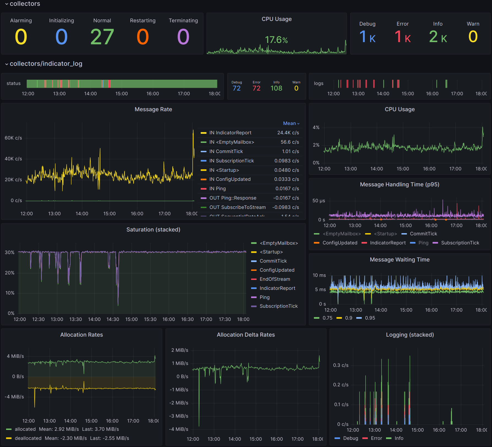

# Introduction

This book aims to describe a superior approach to build heavily asynchronous and distributed applications based on the actor model using the [elfo] framework.

## Goals

* Facilitate the development of resilient, fault-tolerant systems.
* Maintain enough performance to meet the needs of low-latency systems.
* Enhance observability through extensive metrics to identify and rectify issues promptly.
* Offer built-in support for exposing log events, dumps, metrics, and trace events.
* Simplify the process of distributing actors across multiple machines.

## Non-goals

* Provide the most performant way to communicate between actors.
* Provide any HTTP/WS server functionalities.

## Features

* Asynchronous actors equipped with supervision and a customizable life cycle.
* Two-level routing system: between actor groups (pipelining) and inside them (sharding).
* Protocol diversity: actors have the capability to process messages from various protocols, defined in different places.
* Varied communication patterns: regular messages, request-response (*TODO: subscriptions*).
* Dynamic configuration updates and distribution.
* Suitable for tasks requiring both low latency and high throughput.
* Tracing: every message is assigned a `trace_id` which spreads system-wide implicitly.
* Telemetry through the [metrics] crate.
* Dumping: messages can be archived for subsequent debugging.
* Effortless distribution across nodes.
* Utilities for straightforward testing.

The term "observability" could be better understood through demonstration. Consider, for example, the concept of metrics:

[elfo]: https://github.com/elfo-rs/elfo
[metrics]: https://docs.rs/metrics
