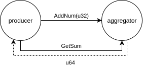

# Hello, World

In this chapter we build a small elfo-based application from the ground up.

The system has two actors:

* **producer** sends a stream of numbers to the aggregator.
* **aggregator** accumulates a running sum and answers queries about it.

Their interaction is pretty simple:



**Note**: the full code for this example is available in [the elfo repository][full code].

## Step 1: Installation

Add the following dependencies in your `Cargo.toml`:

```toml
[dependencies]
# The actor framework itself. The `full` feature enables all built-in batteries:
# configurer, logger, telemeter, dumper, etc.
elfo = { version = "0.2.0-alpha.21", features = ["full"] }
```

> **Note:** `elfo` is currently in alpha. Check [crates.io] for the latest published version and update the version string accordingly.

Put everything in `src/main.rs` for now. In a real project you would split actors into separate crates, see the [Project Structure] recipe for guidance, but a single file is fine for learning.

## Step 2: Define the protocol

Actors should not depend on each other's implementation. Instead, they should only depend on shared messages that they exchange. It decouples the actors and makes the system more modular, easier to test.

This decoupling allows you to change the internals of an actor without breaking its clients, and it also makes it easier to reuse actors across projects.

The right place to put shared message types is a protocol module (or, in larger projects, dedicated crates).

```rust
mod protocol {
    use elfo::prelude::*;

    // A plain fire-and-forget command.
    // `#[message]` derives elfo::Message, Debug, Clone, Serialize, Deserialize.
    #[message]
    pub struct AddNum {
        pub num: u32,
    }

    // A request: `ret = u64` means the sender expects a `u64` back.
    #[message(ret = u32)]
    pub struct GetSum;
}
```

Every type that flows through a mailbox must be annotated with `#[message]`. The macro enforces necessary trait bounds.

## Step 3: Write the producer

The producer sends numbers to the aggregator, then asks for the final sum.

```rust
mod producer {
    use elfo::prelude::*;

    use crate::protocol::*;

    pub fn new() -> Blueprint {
        ActorGroup::new().exec(|ctx| async move {
            // Send numbers.
            for num in 0..10u32 {
                let _ = ctx.send(AddNum { num }).await;
            }

            // Ask the aggregator for the current sum and wait for the reply.
            match ctx.request(GetSum).resolve().await {
                Ok(sum) => tracing::info!(sum, "done"),
                Err(err) => tracing::error!(%err, "request failed"),
            }
        })
    }
}
```

`ctx.send()` is fire-and-forget: it returns as soon as the message lands in the mailbox. `ctx.request().resolve().await` sends a request and suspends the actor until the response arrives.

## Step 4: Write the aggregator

The aggregator keeps a running sum and responds to `GetSum` queries.

```rust
mod aggregator {
    use elfo::prelude::*;

    use crate::protocol::*;

    pub fn new() -> Blueprint {
        ActorGroup::new().exec(|mut ctx| async move {
            let mut sum = 0u32;

            // The main actor loop: receive a message, handle it, repeat.
            // Returns `None` (breaking the loop) when the mailbox is closed.
            while let Some(envelope) = ctx.recv().await {
                msg!(match envelope {
                    AddNum { num } => {
                        sum += num;
                    }
                    // The `(Request, token)` pattern handles a request-response pair.
                    (GetSum, token) => {
                        ctx.respond(token, sum);
                    }
                });
            }
        })
    }
}
```

`msg!` is required because Rust's built-in `match` only works with a single type, but a mailbox can carry many different message types. The macro unpacks the envelope and dispatches on the inner type while keeping `rustfmt`-compatible syntax.

## Step 5: Wire up the topology

A *topology* is the wiring diagram: which actor groups exist, how messages flow between them, and which implementations are used.

```rust
fn topology() -> elfo::Topology {
    let topology = elfo::Topology::empty();

    // Set up built-in actors (logging, config distribution).
    let logger = elfo::batteries::logger::init();
    let loggers = topology.local("system.loggers");
    let configurers = topology.local("system.configurers").entrypoint();

    // Declare your own groups.
    let producers = topology.local("producers");
    let aggregators = topology.local("aggregators");

    // Messages sent by the producer are forwarded to the aggregator.
    producers.route_all_to(&aggregators);

    // Bind blueprints to groups.
    producers.mount(producer::new());
    aggregators.mount(aggregator::new());
    loggers.mount(logger);
    configurers.mount(elfo::batteries::configurer::fixture(
        &topology,
        elfo::config::AnyConfig::default(),
    ));

    topology
}
```

We use `route_all_to` here to forward every message that the producer sends into the aggregator's mailbox.

The topology itself doesn't start anything, so we need to call `elfo::init::start()` to do it:

```rust
#[tokio::main]
async fn main() {
    elfo::init::start(topology()).await;
}
```

`elfo::init::start` blocks until the system shuts down. The configurer starts first, loads `config.toml`, and then the rest of the actors begin their `exec` functions.

## Step 6: Run the program

```console
$ cargo run
   Compiling elfo-examples v0.0.0 (/home/code/fave/elfo/examples)
    Finished `dev` profile [unoptimized + debuginfo] target(s) in 0.91s
     Running `target/debug/hello_world`
2026-03-05 09:19:00.228283494  INFO [7661362937482706945] system.configurers/_ - started	addr=3/312073041333thread=tokio-runtime-worker
2026-03-05 09:19:00.228325401  INFO [7661362937482706945] system.configurers/_ - status changed	status=Normal
2026-03-05 09:19:00.228350429  INFO [7661362937482706945] system.configurers/_ - using a fixture
2026-03-05 09:19:00.228381124  INFO [7661362937482706945] system.configurers/_ - status changed	status=Normal	details=validating
2026-03-05 09:19:00.228573146  INFO [7661362937482706945] system.configurers/_ - status changed	status=Normal	details=updating
2026-03-05 09:19:00.228757835  INFO [7661362937482706945] system.configurers/_ - status changed	status=Normal
2026-03-05 09:19:00.228768493  INFO [7661362937482706945] system.loggers/_ - started	addr=2/312073041334	thread=tokio-runtime-worker
2026-03-05 09:19:00.228788056  INFO [7661362937482706945] system.configurers/_ - groups' configs are updated	groups=["system.loggers", "system.configurers", "producers", "aggregators"]
2026-03-05 09:19:00.228800092  INFO [7661362937482706945] producers/_ - started	addr=4/312073041335	thread=tokio-runtime-worker
2026-03-05 09:19:00.228843383  INFO [7661362937482706945] system.loggers/_ - status changed	status=Normal
2026-03-05 09:19:00.228872997  INFO [7661362937482706945] system.configurers/_ - config updated
2026-03-05 09:19:00.228909195  INFO [7661362937482706945] aggregators/_ - started	addr=5/312073041336	thread=tokio-runtime-worker
2026-03-05 09:19:00.228920874  INFO [7661362937482706945] system.init/_ - status changed	status=Normal
2026-03-05 09:19:00.228923888  INFO [7661362937482706945] aggregators/_ - status changed	status=Normal
2026-03-05 09:19:00.228991147  INFO [7661362937482706945] producers/_ - done	sum=45
2026-03-05 09:19:00.229008241  INFO [7661362937482706945] producers/_ - status changed	status=Terminated
```

Press `Ctrl+C` to gracefully terminate your program.

## What's next?

You now have a working `elfo` system. The following chapters go deeper into each concept introduced here.

Check [the usage example] for a more complex application that demonstrates more features of the framework.

[full code]: https://github.com/elfo-rs/elfo/blob/master/examples/hello_world.rs
[the usage example]: https://github.com/elfo-rs/elfo/blob/master/examples/usage/main.rs
[crates.io]: https://crates.io/crates/elfo
[Project Structure]: ./ch07-01-project-structure.html
