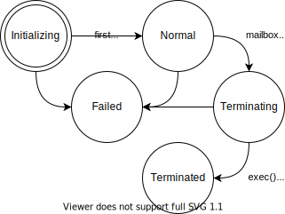

# Actor lifecycle

An actor goes through several stages in life. Transitions between stages are accompanied by statuses. Statuses help us to understand better what's happening with actors. So, a good way to understand actor lifecycle is to get familiar with statuses.

## Statuses

* `Initializing`

    An initial status.
    The actor doesn't handle incoming messages and is doing some initialization, e.g. subscribing to other actors, collecting an initial state, connecting to DB etc.

* `Normal`

    The actor handles incoming messages.

    This status appears on first `ctx.(try_)recv()` call.

* `Terminating`

    An actor is preparing to termination, e.g. doing some cleanup, flushing data etc.

    It happens when the actor's [mailbox is closed][mailbox] and all messages are handled. Additionally, if the actor uses `TerminationPolicy::manually`, it also happens when `Terminate` is received.

* `Terminated`

    A terminal status. The actor's `exec()` finished without errors.

* `Alarming`

    The actor has some long term problem, but still handles messages, maybe in a special way.

    Currently, this status can be set manually only.

* `Failed`

    A terminal status. The actor panicked or his `exec()` returns `Err`.

## Built-in status transitions



The schema doesn't include the `Alarming` status, because it can be set only manually for now.

From the point of view of the main actor's loop:
```rust,ignore
async fn exec(ctx: Context) {
    // Status: Initializing
    //  subscribe to other actors, connect to DB etc

    while let Some(envelope) = ctx.recv().await {
        // Status: Normal
        //  handle messages
    }

    // Status: Terminating
    //  make cleanup, flush data etc
} // Status: Terminated or Failed
```

## Manual status management
It's possible to avoid managing statuses totally, built-in logic is reasonable enough. However, with the increasing complexity of actors, it can be helpful to provide more information about the current status.

The basic way to change status:
```rust,ignore
ctx.set_status(ActorStatus::ALARMING);
```

Also, details can be provided with each status:
```rust,ignore
ctx.set_status(ActorStatus::INITIALIZING.with_details("loading state"));
```

## Subscribing to actor's statuses
TODO: `SubscribeToActorStatuses`, `ActorStatusReport`

[mailbox]: ./ch02-01-a-mailbox.html
