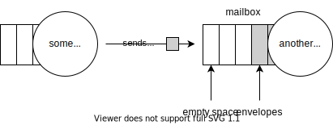

# Actors

The most important part of the actor model is, of course, the actor itself. It can be challenging to give the exact definition of this term. However, we can define an actor through its properties:

* An actor is a unit of scheduling

    Different threads cannot execute the same actor simultaneously. However, many actors are executed concurrently, often parallel in many threads.

* An actor is a unit of data encapsulation

    Actors shouldn't share their data with other actors, shouldn't expose implementation details, etc.

* An actor is a unit of failure encapsulation

    Actors can fail, and it doesn't affect the work of other actors directly.

* An actor is a unit of logic encapsulation

    Actors solve a specific task instead of doing it all at once.

* An actor is a unit of communication

    Actors can communicate with others by sending and receiving messages. Actors are uniquely identified by their addresses.

These properties allow us to build highly scalable and fault-tolerant systems relatively thinkable and straightforwardly without using complex concurrent data structures.

## A Mailbox

Every actor has his own mailbox, a queue containing envelopes sent by other actors to this one.

What's the envelope? The envelope is a wrapper around a message that includes also some useful metadata: the sender's address, time of sending moment, and some other information that is not so important for now.



A mailbox is the main source of messages for any actor. Messages are handled sequentially.

A mailbox can become full if the corresponding actor doesn't have time to process the message flow. In this case, the sending actor can decide to drop the message, wait for space in the mailbox or resend after some time. Such strategies will be discussed later.

## Functional actors

Let's define a some simple actor using `elfo` and figure out what's happening.

The simplest way to define an actor is functional style.

For example, let's define the simplest counter:
```rust,ignore
use elfo::prelude::*;

#[message]
pub struct Increment {
    pub delta: u32,
}

#[message(ret = u32)]
pub struct GetValue;

pub fn counter() -> Schema {
    ActorGroup::new().exec(|mut ctx| async move {
        // Private state of the actor.
        let mut value = 0;

        // The main actor loop: receive a message, handle it, repeat.
        // Returns `None` and breaks the loop if actor's mailbox is closed
        // (usually when the system terminates).
        while let Some(envelope) = ctx.recv().await {
            msg!(match envelope {
                Increment { delta } => {
                    value += delta;
                },
                // It's a syntax for requests.
                (GetValue, token) => {
                    // ... and responses.
                    ctx.respond(token, value);
                },
            })
        }
    })
}
```

We haven't discussed actor groups yet, so don't pay attention for now.

Instead, let's talk about other things in the example:
* `ctx.recv()` allows us to wait for the next message asynchronously. Thus, if the mailbox is empty, the actor will return control to the scheduler instead of spending CPU cycles or sleeping.
* `msg!` allows us to unpack envelopes and match against different types of messages. It's required, because Rust's `match` must include patterns for the same data type only. However, we want to support different messages, often defined in different crates. Also, reusing the `match` syntax is highly desired in order to work well with tooling like `rustfmt` and `rust-analyzer`.
* `(RequestType, token)` is the syntax for handling requests. `token` can be used no more than once, thanks to Rust, so we cannot accidentally respond to the request twice. Also, the compiler will warn if we forget to handle `token`. If the token is explicitly dropped without responding, the sending side will get the special error and decide whether it's normal or not.

Now let's define another actor to communicate with the counter:
```rust,ignore
use elfo::prelude::*;
use counter::{Increment, GetValue};

pub fn sample() -> Schema {
    ActorGroup::new().exec(|ctx| async move {
        // Increment the counter, we aren't interested in errors.
        let _ = ctx.send(Increment { delta: 1 }).await;
        // ... and again.
        let _ = ctx.send(Increment { delta: 3 }).await;

        // Request the current counter's value and wait for the response.
        if let Ok(value) = ctx.request(GetValue).resolve().await {
            tracing::info!(value, "got it!");
        }
    }
}
```

We haven't connected our actors in any way, this will be discussed later.
