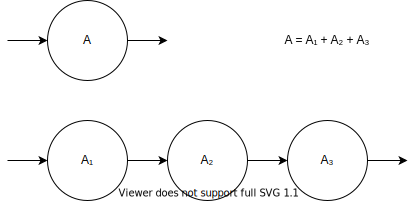
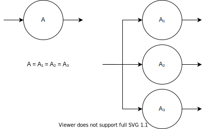

# Actor Groups

Before talking about actor groups, we need to consider another vital topic: *scaling*.

## Scaling
Scaling is helpful both to increase throughput of a system and reduce latency.

Two known ways to do scaling are *pipelining* and *sharding*.

### Pipelining
Pipelining implies dividing the system into several sequential parts. Thus, instead of doing all work in one actor, different actors do the work in parts.

Pipelining increases minimal possible latency because of overhead costs but can reduce maximal latency because of parallel execution of different parts. Throughput is the minimum of parts' throughputs. However, total throughput increases because every actor in the pipeline does less work.

Usually, it's not necessary to think about pipelining because well-designed systems are already divided into multiple actors according to their responsibilities, not because of performance requirements.

### Sharding
Sharding implies multiple running actors with the same, possible parameterized, code and responsibility.

Sharding requires some work to route messages to the corresponding shard. Thus, throughput is increased sublinearly. Similarly to pipelining, maximal latency is reduced because arrival messages see ahead of themself fewer messages.

## Actor Groups
Actor groups in `elfo` are a solution for the sharding problem. Each actor has some actor key, a unique label inside a group, that can be used for routing purposes.

The group's router is not an actor but some shared code that's executed on sending side to determine which actor should receive a message. Usually, routers are stateless; thus, this approach is more performant and scalable than routers implemented as separate actors.

`elfo` doesn't support running actors without actor groups. Instead, it's ok to use groups with only one actor inside if it's meaningless to do sharding for now.

Note that actor keys can be arbitrary structures, not mandatory strings.

See the next chapter to get more details about routing.

## Stability
TODO: move to the first usage.

It's useful to know the term *stability*. Stable systems are restricted only by input rate and don't have 100% utilization. We usually want to minimize latency in such systems while keeping throughput higher than real-life requirements. Most of systems are supposed to be stable and have predictable latency. Unstable systems have 100% utilization and reach their throughput. For instance, ETL systems.
