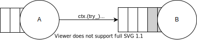
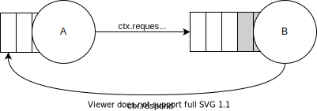

# Communication

Actors can communicate in many ways depending on the situation and desired guarantees.

## Fire and Forget

The most straightforward way is to send a message with minimal guarantees.



However, it's possible to choose the desired behavior by calling the most appropriate method. All variants can be described by the following template: `(try_|unbounded_)send(_to)`.

Methods with the `_to` suffix allow to specify a destination address as the first argument. Otherwise, [the routing subsystem][routing] will be used.

The prefix describes what should happen if the destination mailbox is full:

| Syntax             | Error cases      |  Description |
| ------------------ | ---------------- | ------------ |
| `send().await`     | `Closed`         | Blocks until a destination mailbox has space for new messages |
| `try_send()`       | `Full`, `Closed` | Returns `Full` if the mailbox is full |
| `unbounded_send()` | `Closed`         | Forcibly increase the mailbox, **not implemented yet** |

All methods can return `Closed` if the destination actor is closed.

The form `send().await` is used when desired behavior is backpressure, while `try_send()` is for actors with predicted latency, when it's acceptable to lose messages or it can be handled manually. `unbounded_send()` should be avoided because it can increase mailboxes unpredictably, leading to OOM.

### Examples

```rust,ignore
#[message]
struct SomeMessage;

// Do not care if the target actor is closed or full.
let _ = ctx.try_send(SomeMessage);

// Block if the destination mailbox is full and ignore if closed.
let _ = ctx.send(SomeMessage).await;

// Fail the current actor if the destination is closed.
ctx.send(SomeMessage).await?;

// Manually implement backpressure, e.g. store messages.
if let Err(err) = ctx.try_send(SomeMessage) {
    let msg = err.into_inner(); // msg: SomeMessage
}
```

## Blocking Request-Response

Some communications between actors require response message being sent back to the sender.


TODO

### Examples

```rust,ignore
#[message(ret = Result<(), DoSomethingRejected>)]
struct DoSomething;

#[message]
struct DoSomethingRejected(String);

TODO
```

## Non-blocking Request-Response


TODO

### State

TODO

### Examples

TODO

## Subscriptions

**TODO**


[routing]: ./ch04-01-routing.html
