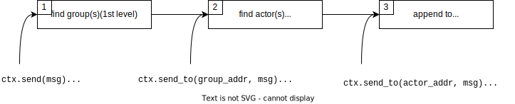
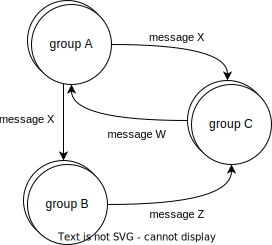
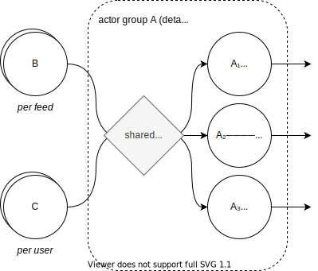

# Routing

Routing is the process of searching for the actor that will handle a sent message. In order to append the message to his mailbox, we need to discover the actor's address.

`elfo` offers a two-level routing system. What does it mean? Messages can pass through up to two steps of routing, depending on used methods, as shown on the following diagram:



1. If we don't know any address (`ctx.(try_)send(msg)` and `ctx.request(msg)`), the inter-group router is called to determine which groups are interested in the message. Then, the corresponding inner-group router is called for each interested group to decide which shards should receive the message.
2. Only the inner-group router is called if we already know a group's address (`ctx.(try_)send_to(group_addr, msg)` and `ctx.request_to(group_addr, msg)`).
3. If we already know an actor's address (`ctx.(try_)send_to(actor_addr, msg)` and `ctx.request_to(actor_addr, msg)`), nothing additional is done because we already know which actor should handle the message.

Note that if several actors are interested in the message, each receives a copy of the message. It's ok for messages without heap-allocated fields or for rare messages, but for the big ones consider wrapping into `Arc` to reduce the `clone()` overhead.

## Inter-group routing

Inter-group routing is responsible for connecting actor groups among themselves.

Let's consider the following architecture scheme:



Actor groups and connections between them are defined in so-called "topology":

```rust
fn topology(config_path: &str) -> elfo::Topology {
    let topology = elfo::Topology::empty();
    let logger = elfo::logger::init();

    // Define system groups.
    let loggers = topology.local("system.loggers");
    let telemeters = topology.local("system.telemeters");
    let dumpers = topology.local("system.dumpers");
    let pingers = topology.local("system.pingers");
    let configurers = topology.local("system.configurers").entrypoint();

    // Define user groups.
    let group_a = topology.local("group_a");
    let group_b = topology.local("group_b");
    let group_c = topology.local("group_c");

    // Define connections between user actor groups.
    group_a.route_to(&group_b, |e| { // "e" means "Envelope"
        msg!(match e {
            MessageX | MessageY => true,
            _ => false,
        })
    });
    group_a.route_to(&group_c, |e| {
        msg!(match e {
            MessageX => true,
            _ => false,
        })
    });
    group_b.route_to(&group_c, |e| {
        msg!(match e {
            MessageZ => true,
            _ => false,
        })
    });
    group_c.route_to(&group_a, |e| {
        msg!(match e {
            MessageW => true,
            _ => false,
        })
    });

    // Mount specific implementations.
    loggers.mount(logger);
    telemeters.mount(elfo::telemeter::new());
    dumpers.mount(elfo::dumper::new());
    pingers.mount(elfo::pinger::new(&topology));

    // Actors can use `topology` as a service locator.
    // Usually it should be used for utilities only.
    configurers.mount(elfo::configurer::from_path(&topology, config_path));

    group_a.mount(group_a::new());
    group_b.mount(group_b::new());
    group_c.mount(group_c::new());

    topology
}
```

Not all messages should be specified at this level. Usually, only requests and some multicast events are specified here, but not messages that will be passed directly, such as responses or events of subscriptions.

## Inner-group routing

Inner-group routing is responsible for choosing which shards should handle incoming messages.



The inner-group router is defined next to the actor implementation, in the group declaration.

### Stateless router

```rust
use elfo::routers::{Outcome, MapRouter};

ActorGroup::new()
    .router(MapRouter::new(|e| {
        msg!(match e {
            MessageX { key, .. } => Outcome::Unicast(key),
            MessageY { keys, .. } => Outcome::Multicast(keys.to_vec()),
            MessageZ => Outcome::Broadcast,
            _ => Outcome::Default,
        })
    }))
    .exec(exec);
```

Possible `Outcome`'s variants:
* `Outcome::Unicast` sends the message only to the actor with a specified key. If there is no active or restarting actor for the key, the new one will be started.
* `Outcome::GentleUnicast` works like `Outcome::Unicast`, but doesn't lead to spawning new actors, instead a message is discarded.
* `Outcome::Multicast` sends to several actors. New actors will be started.
* `Outcome::GentleMulticast` works like `Outcome::Multicast`, but doesn't lead to spawning new actors, instead a message is discarded.
* `Outcome::Broadcast` sends to all active actors.
* `Outcome::Discard` drops the message (that leads to an error on sending side).
* `Outcome::Default` behaviour depends on the message type:
    - `Outcome::Discard` for `ValidateConfig` message.
    - `Outcome::Broadcast` for all other system messages (such as `UpdateConfig`, `Terminate`, etc).
    - `Outcome::Discard` for user-defined messages.

### Stateful router

Sometimes we need to use a router with rarely changing state. If the state should be changed often, consider using a dedicated actor as a router.

To create a stateful router use the `MapRouter::with_state` constructor. Note that the state type should implement `Default`, `Send` and `Sync`.

```rust
ActorGroup::new()
    .router(MapRouter::with_state(
        // Called if the config is changed.
        |config: &Config, state| make_new_state(..),
        // The routing function.
        |e, state| {
            msg!(match e { .. })
        }
    ))
    .exec(exec);
```

The state is recreated every time when the config is changed. Useful when all needed information (e.g. a list of actors) can be extracted from the config. Note that recreation doesn't block execution; the state is atomically replaced only once `make_new_state(..)` is finished.
