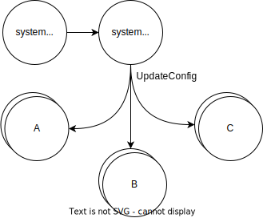
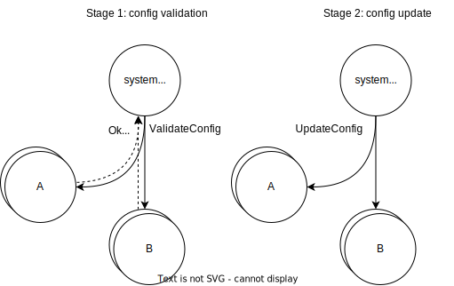
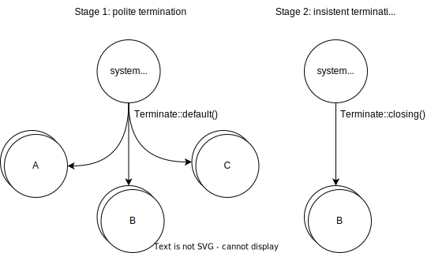

# Supervision

## Startup

Once the system is started, the `system.init` actor starts all actors marked as `entrypoint()` in the topology. Usually, it's only the `system.configurers` group. Entry points must have empty configs.

Then, `system.configurers` loads the config file and sends `UpdateConfig` to all actor groups. Thus, if you need to start actors, the `UpdateConfig` message must be routed to the necessary keys.



Note that the actor system terminates immediately if the config file is invalid at startup (`elfo::start()` returns an error).

## Reconfiguration

Reconfiguration can be caused in several cases:
* The configurer receives `ReloadConfigs` or `TryRealodConfigs`.
* The process receives `SIGHUP`, it's an equivalent to receiving `ReloadConfigs::default()`.
* The process receives `SIGUSR2`, it's an equivalent to receiving `ReloadConfigs::default().with_force(true)`.

What's the difference between default behavior and `with_force(true)` one? By default, group's up-to-date configs aren't sent across the system. In the force mode, all configs are updated, even unchanged ones.

The reconfiguration process consists of several stages:


1. Config validation: the configurer sends the `ValidateConfig` request to all groups and waits for responses.
2. If all groups respond `Ok(_)` or ignore the request, the config is considered valid, and the configurer sends `UpdateConfig` to all groups. If at least one actor responds `Err(_)`, reconfiguration is aborted, and a new config isn't used.

More information about configs and the reconfiguration process is available on [the corresponding page][configuration].

## Restart

Three restart policies are implemented now:
* `RestartPolicy::on_failures` (by default) — actors are restarted only after failures (the `exec` function returned `Err` or panicked).
* `RestartPolicy::always` — actors are restarted after termination (the `exec` function returned `Ok` or `()`) and failures.
* `RestartPolicy::never` — actors are never restarted. However, they can be started again on incoming messages.

If the actor is scheduled to be restarted, incoming messages cannot spawn another actor for his key.

Repetitive restarts are limited by a linear backoff mechanism:
* If there are no restarts for 5s, restart an actor immediately.
* Otherwise, increase restart time by 5s and schedule restarting.
* Maximum restart time is limited by 30s.

These constants aren't configurable for now ([elfo#62](https://github.com/elfo-rs/elfo/issues/62)).

The restart policy can be chosen while creating `ActorGroup`:
```rust
use elfo::group::{RestartPolicy, ActorGroup};

ActorGroup::new().restart_policy(RestartPolicy::always())
ActorGroup::new().restart_policy(RestartPolicy::on_failures())
ActorGroup::new().restart_policy(RestartPolicy::never())
```

## Termination

System termination is started by the `system.init` actor in several cases:
* Received `SIGTERM` or `SIGINT` signals, Unix only.
* Received `CTRL_C_EVENT` or `CTRL_BREAK_EVENT` events, Windows only.
* Too high memory usage, Unix only. Now it's 90% (ratio of RSS to total memory) and not configurable ([elfo#60](https://github.com/elfo-rs/elfo/issues/60)).

The process consists of several stages:


1. `system.init` sends to all user-defined groups "polite" `Terminate::default()` message.
    * Groups' supervisors stop spawning new actors.
    * `Terminate` is routed as a usual message with `Outcome::Broadcast` by default.
    * For `TerminationPolicy::closing` (by default): the mailbox is closed instantly, `ctx.recv()` returns `None` after already stored messages.
    * For `TerminationPolicy::manually`: the mailbox isn't closed, `ctx.recv()` returns `Terminate` in order to handle in on your own. Use `ctx.close()` to close the mailbox.
2. If some groups haven't terminated after 30s, `system.init` sends `Terminate::closing()` message.
    * `Terminate` is routed as a usual message with `Outcome::Broadcast` by default.
    * For any policy, the mailbox is closed instantly, `ctx.recv()` returns `None` after already stored messages.
3. If some groups haven't terminated after another 15s, `system.init` stops waiting for that groups.
4. Repeat the above stages for system groups.

Timeouts above aren't configurable for now ([elfo#61](https://github.com/elfo-rs/elfo/issues/61)).

The termination policy can be chosen while creating `ActorGroup`:
```rust
use elfo::group::{TerminationPolicy, ActorGroup};

ActorGroup::new().termination_policy(TerminationPolicy::closing())
ActorGroup::new().termination_policy(TerminationPolicy::manually())
```

[configuration]: ./ch04-03-configuration.md
