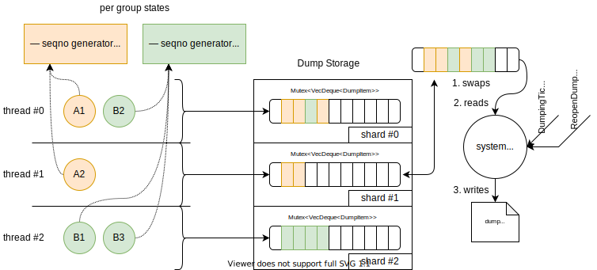

# Dumping

## Introduction

Dumping is the process of storing incoming and outgoing messages for every actor, including ones from [mailboxes][mailbox] and all other [sources][source] like timers, streams, and so on. The primary purpose is future [tracing][tracing], but it also can be used for [regression testing][regression].

Dumping has a lot of common with [logging][logging], but it's more efficient and optimized for storing a lot of messages, so it has high throughput requirements instead of low latency like in the logging task, where records are supposed to be delivered as soon as possible, especially warnings and errors.

## Usage

### Enable dumping

Dumping is disabled by default until the topology contains the `system.dumpers` group.

Elfo provides the default implementation for such group, that's available with the `full` feature and exported as `elfo::dumper`:
```rust,ignore
let topology = elfo::Topology::empty();
let dumpers = topology.local("system.dumpers");

// ...

dumpers.mount(elfo::dumper::new());
```

Besides this, the path to a dump file must be specified in the config:
```toml
[system.dumpers]
path = "path/to/dump/file.dump"
```

### Configure dumping on a per-group basis

Dumping settings can be specified for each actor group individually.
Note that the settings can be changed and applied [on the fly][configs].

Example:
```toml
[some_actor_group]
system.dumping.disabled = true      # false by default
system.dumping.rate_limit = 100500  # 100000 by default
```

Dumps above the rate limit are lost, but the sequence number is incremented anyway to detect missed messages later.

### Configure dumping on a per-message basis

Simply add the `message(dumping = "disabled")` attribute to the message. Another and default value of the attribute is `"full"`.
```rust,ignore
#[message(dumping = "disabled")]
pub struct SomethingHappened {
    // ...
}
```

### Shorten fields of a message

Sometimes the content of messages is too large, for instance, in writing a backend for graph plotting, where every response can contain thousands of points. We don't want to lose additional information about responses, but saving whole messages is very expensive in this case.

For this situation, elfo provides a helper to hide specified fields during serialization, but only in the dumping context. So, these messages still will be properly sent over the network, where serialization is used too.

```rust,ignore
#[message]
pub struct ChunkProduced {
    pub graph_id: GraphId,
    #[serde(serialize_with = "elfo::dumping::hide")]
    pub points: Vec<(f64, f64)>,   // will be dumped as "<hidden>"
}
```

Such messages cannot be deserialized properly; that's ok until they are used as input for [regression testing][regression].

## Metrics
TODO

## Local storage

The default implementation of dumpers writes all dumps to a file on the local file system.

Even home-purpose SSDs can achieve 3GiB/s in 2021, which should be more than enough to avoid a bottleneck in this place.

Dumps are stored in an uncompressed way so that they can take a lot of space. So, it's essential to rotate the dump file timely and delete outdated ones.

Note that message ordering between actor groups (and even inside the same actor) can be easily violated because of [implementation details][implementation]. Therefore, in the case of reading from local dump files, you should sort rows by the timestamp field.

## The structure of dump files

Dump files contain messages in the newline-delimited JSON format. Each line is object containing the following properties:
* `g` — an actor group's name
* `k` — an *optional* actor's key
* `n` — [`node_no`][distributed]
* `s` — `sequence_no`, unique inside an actor group
* `t` — [`trace_id`][tracing]
* `ts` — timestamp
* `d` — direction, "In" or "Out"
* `cl` — an *optional* class
* `mn` — a message's name
* `mp` — a message's protocol, usually a crate, which contains the message
* `mk` — a message's kind, "Regular", "Request" or "Response"
* `m` — a *nullable* message's body
* `c` — an *optional* correlation id, which links requests with corresponding responses

Terms:
* *optional* means that the property can be omitted, but if it's present, then its value isn't `null`.
* *nullable* means that the property is present always, but the value can be `null`.

The `sequence_no` field can be used to detect missed messages because of limiting.

**TODO: note about classes**

## Dump file rotation

`elfo::dumper` doesn't use any kind of partitioning and relies on an external file rotation mechanism instead. It means some additional configuration is required, but it provides more flexibility and simplifies the dumper.

The dumper listens to the `SIGHUP` signal to reopen the active dump file. Besides this, the dumper accepts the `elfo::dumper::ReopenDumpFile` command.

The most popular solution for file rotation is, of course, `logrotate`.

**TODO: logrotate config**

Tip: if dumps are not supposed to be delivered to DB, use hard links to save the dump file for later discovery and avoid deletion.

## Remote storage

Depending on your goals, you may or may not want to send your dump files to remote file storage. It can highly improve search capabilities (primarily because of indexing trace_id) and space usage but requires additional infrastructure for dumping. Usually, it's ok for many services to use only local storage. Dumps are stored in a time-ordered way and, thanks to the structure of trace_id, can be used for good enough search. However, elfo doesn't provide the utility to search these files for now.

Ok, so you want to store dumps in DB. The right choice, if you can afford it. What should you do?

The common schema looks like


**TODO: add a link to the example with vector.dev and clickhouse**

## Implementation details

At a top level, dumping is separated into two parts: the dumping subsystem and the dumper.

The dumping subsystem is based on sharded in-memory storage containing a limited queue of messages. We use a predefined number of shards for now, but we will likely use the number of available cores in the future. Every thread writes to its dedicated shard. Such an approach reduces contention and false sharing between threads.



The dumper sequentially, in a round-robin way, replaces the shard's queue with the extra one, then reads and serializes all messages and writes them to the dump file. All this work happens on a timer tick. Firstly,  it's one of the simplest ways to get appropriate batching. Secondly, because the dumper uses [tokio::task::spawn_blocking](https://docs.rs/tokio/1/tokio/task/fn.spawn_blocking.html) and blocking writes insides, that's more effective than using async [tokio::fs](https://docs.rs/tokio/1/tokio/fs/index.html) directly. The timer approach allows us to reduce the impact on the tokio executor. However, this behavior is going to be improved for environments with io_uring in the future.

The dumper holds the lock only for a small amount of time to replace the queue inside a shard with another one, which was drained by the dumper on the previous tick. Thus, the actual number of queues is one more than shards.

All actors in a group share the same handler with some common things like sequence_no generator and rate limiter. Whenever an actor sends or receives a message, the handler is used to push message to the shard according to the current thread. Thus, messages produced by the same actor can reorder if it's migrated to another thread by a scheduler.

Yep, we can restore order in the dumper, but don't do it now because remote DB is doing it anyway. However, we can add the corresponding option in the future. It's not trivial, although.

[implementation]: #implementation-details

[mailbox]: ./ch02-01-a-mailbox.html
[source]: ./ch02-02-sources.html
[configs]: ./ch02-06-configuration.html
[distributed]: ./ch03-00-dustributed-actors.html
[logging]: ./ch04-01-logging.html
[tracing]: ./ch04-04-tracing.html
[regression]: ./ch06-02-the-replayer.html
