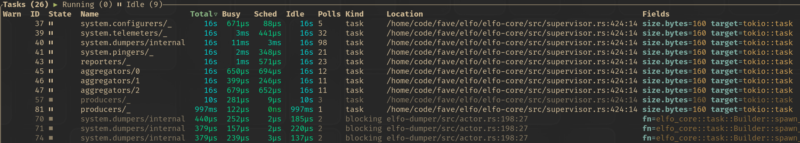

# Tokio Console

[tokio-console] is a diagnostics and debugging tool for async Rust programs. It provides a TUI to inspect the state of async tasks and resources in a running tokio runtime.

Elfo integrates with tokio-console by naming all tasks that run actors or spawned by `elfo::task::spawn_blocking()` or `elfo::task::Builder`:


Firstly, add `console-subscriber` to dependencies and enable the `tokio-tracing` feature of elfo:

```toml
[dependencies]
elfo = { version = "0.2.0-alpha.21", features = ["tokio-tracing"] }
console-subscriber = "0.5.0"
```

Secondly, we need manually initialize the `tracing` subscriber instead of letting elfo do it for us:

```rust
let (blueprint, scope_filter, capture_layer) = elfo::batteries::logger::new();

tracing_subscriber::registry()
    .with(console_subscriber::spawn())
    .with(capture_layer.with_filter(scope_filter))
    .init();

loggers.mount(blueprint);
```

Finally, compile with `--cfg tokio_unstable` to opt into tokio's unstable task instrumentation:

```sh
RUSTFLAGS='--cfg tokio_unstable' cargo run
```

That's all! Now we can run `tokio-console` to run the TUI and connect to our application.

Check [this example](https://github.com/elfo-rs/elfo/blob/master/examples/tokio_console.rs) for a complete code sample.

[tokio-console]: https://github.com/tokio-rs/console
