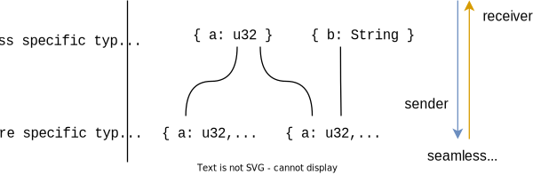
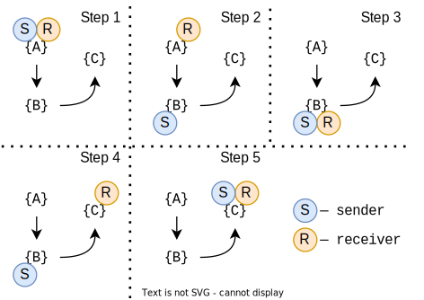

# Protocol Evolution

It's hard to update all nodes in distributed systems simultaneously. Firstly, it requires synchronization of releases and teams. Secondly, it means all nodes become unavailable until the update is finished, which can be highly unpleasant for users.

An alternative approach is updating nodes one by one without any kind of locks between them. However, they can become incompatible with each other because the communication protocol has evolved. That's where a protocol evolution appears. If a message is sent to another node, we should be more careful when changing it.

Communication is based on the `msgpack` format. It's close to `JSON`, but binary encoded and more feature-rich: it supports arbitrary map keys, special values of floats (`NaN`, `±inf`), and binary data. However, the ability to evolve is the same, so the rules of evolution are also similar.

It's worth noting that the compatibility of nodes can be checked automatically on a per-message basis (because it's known where a message is used on the sender and receiver part). However, it's unimplemented right now.

## The common principle

Messages are defined in so-called protocol crates. They shouldn't contain any logic, only message definitions and convenient constructors, getters, and setters for them. To understand the common principle of evolution, it needs to distinguish nodes that send a message from those that receive it. Senders and receivers are compiled with different versions of the same protocol crate.

The common principle states: **senders should send a more specific version of a message than receivers accept**.

In this way, if a message in the protocol becomes more specific (e.g., it gets more fields), then senders must be updated first. And, vice versa, if a message becomes less specific (e.g., losing fields), receivers must be updated first. Some changes allow any orders of updating; see the next section for details.

In the case of downgrading nodes, the update order is the opposite.

Let's consider some example of evolution:


It's a simple example of evolution with only adding required fields, but it helps to understand the common principle. Providing more fields from a sender than a receiver expects is always acceptable because a receiver can skip these fields during deserialization. If a receiver is updated first, it will expect more fields, and deserialization will fail.

This principle can be propagated to multiple updates as well:


At step 2, the message becomes more specific, so senders are updated first. At step 4, the message becomes less specific, so receivers are updated first.

## Examples

<table class="protocol-evolution">
<thead><tr>
<td>Action</td><td>Current version</td><td>Next version</td><td>Update ordering</td>
</tr></thead>
<tbody>
<tr><td>

Adding a new required field

</td><td>

```rust,ignore
#[message]
struct Sample {
    a: u32,
}
```

</td><td>

```rust,ignore
#[message]
struct Sample {
    a: u32,
    b: u32,
}
```

</td><td>

Sender, Receiver

</td></tr>
<tr><td>

Adding a new optional field

</td><td>

```rust,ignore
#[message]
struct Sample {
    a: u32,
}
```

</td><td>

```rust,ignore
#[message]
struct Sample {
    a: u32,
    #[serde(default)]
    b: u32,
    c: Option<u32>,
}
```

</td><td>

Any

</td></tr>
<tr><td>

Renaming a field

</td><td>

```rust,ignore
#[message]
struct Sample {
    a: u32,
}
```

</td><td>

```rust,ignore
#[message]
struct Sample {
    #[serde(alias = "a")]
    b: u32,
}
```

</td><td>

Receiver, Sender

</td></tr>
<tr><td>

Removing a required field

</td><td>

```rust,ignore
#[message]
struct Sample {
    a: u32,
    b: u32,
}
```

</td><td>

```rust,ignore
#[message]
struct Sample {
    a: u32,
}
```

</td><td>

Receiver, Sender

</td></tr>
<tr><td>

Promotion of numbers[^promotion]

</td><td>

```rust,ignore
#[message]
struct Sample {
    a: u32,
}
```

</td><td>

```rust,ignore
#[message]
struct Sample {
    a: u64,
    // Any numeric
    // a: i16
}
```

</td><td>

Any

</td></tr>
<tr><td>

(Un)wrapping into a newtype

</td><td>

```rust,ignore
#[message]
struct Sample {
    a: u32,
}
```

</td><td>

```rust,ignore
#[message]
struct Sample {
    a: U32,
}

#[message(part)]
struct U32(u32);
```

</td><td>

Any

</td></tr>
<tr><td>

Adding a new variant

</td><td>

```rust,ignore
#[message]
enum Sample {
    A(u32),
}
```

</td><td>

```rust,ignore
#[message]
enum Sample {
    A(u32),
    B(u32),
}
```

</td><td>

Receiver, Sender

</td></tr>
<tr><td>

Renaming a variant

</td><td>

```rust,ignore
#[message]
enum Sample {
    A(u32),
}
```

</td><td>

```rust,ignore
#[message]
enum Sample {
    #[serde(alias = "A")]
    B(u32),
}
```

</td><td>

Receiver, Sender

</td></tr>
<tr><td>

Removing a variant

</td><td>

```rust,ignore
#[message]
enum Sample {
    A(u32),
    B(u32),
}
```

</td><td>

```rust,ignore
#[message]
enum Sample {
    A(u32),
}
```

</td><td>

Sender, Receiver

</td></tr>
<tr><td>

Replacing a field with an union (a untagged enumeration)

</td><td>

```rust,ignore
#[message]
struct Sample {
    a: u32,
}
```

</td><td>

```rust,ignore
#[message]
struct Sample {
    a: NumOrStr,
}

#[message(part)]
#[serde(untagged)]
enum NumOrStr {
    Num(u32),
    Str(String),
}
```

</td><td>

Any

</td></tr>
<tr><td>

Removing a variant

</td><td>

```rust,ignore
#[message]
enum Sample {
    A(u32),
    B(u32),
}
```

</td><td>

```rust,ignore
#[message]
enum Sample {
    A(u32),
}
```

</td><td>

Sender, Receiver

</td></tr>
<tr><td>

Enumerations with `serde(other)`

</td><td>

```rust,ignore
#[message]
enum Sample {
    A,
    B,
}
```

</td><td>

```rust,ignore
#[message]
enum Sample {
    A,
    #[serde(other)]
    O,
}
```

</td><td>

Receiver, Sender

</td></tr>
</tbody>
</table>

[^promotion]: Promotion to/from `i128` and `u128` doesn't work due to `msgpack`'s implementation details.
